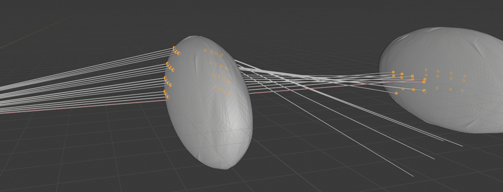

# Cuda-based Bézier triangle mesh raytracer

The aim of this project is to simulate image rendering of arbitrary-shaped "lenses" described by triangle meshes using Bézier triangle interpolation. It will be possible to simulate free-form lenses, and of course spherical lenses as well. (Of course spherical lenses can be simulated much more efficiently.) This project is just for personal learning, so I omit investigation of existing results.

This work is divided into 4 parts:
1. [C++ utilities and preprocessor](#1001). These parts check the input and produce the Bézier mesh appropriate to implement raytracing.
2. [Reference single ray tracing implementation in C++](#1002). I use it actually to develop all geometry and raytracing algorithms, which will later be modified for GPU usage.
3. [Initial implementation in NVIDIA Thrust](#1003), a quick proof-of-concept implementation based on the reference to produce images.
4. An iteratively developed [CUDA version](#1004) for best performance.

[Shortcomings](#1005) are here. I use Eigen3 for vector calculations, because it is well supported under CUDA, and Google Test for unit testing. I also use Sebastian Reiter's STL reader utility to parse STL files.

[Here](https://db.bme.hu/~bamer/tdk/TDK.html) is my ancient naive implementation of spherical lens system simulator from 1994-1998 (in Hungarian). That work originates from the high school with most parts ready then. I've abandoned the work because a 80386 without an FPU was far too slow for any meaningful rendering. During the university I could complete it and use a Sun workstation for rendering the images.

I use At most C++17 features all thorough the code to let it interoperate with CUDA.

## C++ utilities and preprocessor

<a id="1001">For</a> space and performance reasons, I use 3D Cartesian coordinates. Since most container sizes are known or calculable, I use `std::vector`s for simple storage. This will let me directly pass the data to GPU code.

### reference/util.h

This file contain common type declarations for all other sources, some geometry calculations like plane creatian and intersection, triangle altitudes. There is also a simple uniform triangle subdivision function template.

### reference/mesh.h

This is the home of the `Mesh` class. I know there are several good STL and mesh processing libraries, but I've created this class for three reasons:
1. I wanted full control over mesh processing.
2. I wanted to preserve original vertices. If the mesh creation algorithm is sophisticated enough, it knows better where and how to place vertices. Any postprocessing can only make it worse.
3. It contains important preprocessing steps for later stages, which belong to triangle mesh processing, not Bézier triangle meshes.
4. I enjoy working with geometry vectors.

The `Mesh` class exposes a set of STL vector-like interface functions for easier use. It also provides overloaded operators for displace and inflate operations, STL file I/O. Here I only write about the more interesting functions.
Note, this class can only handle a mesh consisting of **exactly one totally filled** shape.

#### Mesh::standardizeVertices

This function is used to make vertices of different triangles coincide when they are practically the same mesh vertex, but have sightly different values from different numeric errors. This will enable later functions to compare floating point values for identity check. Note, these comparisons only occur on output of this function without any subsequent calculations. Here first I calculate an epsilon value for proximity comparisons using the smallest triangle length. Since the naive implementation would be O(n^2), a more sophisticated algorithm is needed.

I solve the problem using 1D projections. For each dimension, I take the vertices in ascending order and group them based on if they are closer to each other than epsilon. Pairwise proximity check will then only be needed in each group. I take the dimension where the maximum groups size is minimal (less degenerate projection) and then perform the pairwise check. I adjust each vertex pair to the smaller one according to an artificial alphabetical ordering of the coordinates.

#### Mesh::standardizeNormals

This function makes all triangle normals point outwards if calculated as `(triangle[1] - triangle[0]).cross(triangle[2] - triangle[0])` (note: `using Triangle = std::array<Vertex, 3u>`). This funtion must be used after `Mesh::standardizeVertices`, and assumes that there is no triangle vertex on the side of an other triangle. The algorithm is roughly
1. Find a vertex with the smallest X coordinate.
2. Find a neighbouring triangle with the smallest x component (negative for all such triangles).
3. Make this triangle good by possibly swapping two vertices.
4. Create a set of triangles with the side neighbours of this initial triangle, marking their known good neighbour as well.
5. Take a triangle from the set, make it good using the info from its known neighbour.
6. Put its unprocessed neighbours to the set.
7. Loop to 5. if the sset is not empty.

This function also gathers auxiliary data for later stages, see below.

#### Mesh::makeEllipsoid(int32_t const aSectors, int32_t const aBelts, Vector const &aSize)

Deletes all current contents and creates an ellipsoid with the given parameters. The triangle vertices will be on the ellipsoid surface. The ellipsoid is approximated somewhat similarly as the azimuth-inclination mesh on the Earth. There will be `aBelts` pieces of "belts" along each "parallel", each divided evenly by `aSectors` vertices. Between the belts there are 2 * `aSectors` pieces of triangles, while between the extreme belts and poles only `aSectors` pieces. The parameter aSize contains the principal semi-axes of the ellipsoid. There is also a special case called `makeUnitSphere` to create a unit sphere.

#### Mesh::getFace2neighbours

Returns an `std::vector<Neighbours>`, each item corresponding to a mesh triangle. Here the struct `Neighbours` holds information about the neighbouring triangles of the aactual one's each side (starting at vertex i within the triangle):
* mFellowTriangles for mesh index of the neighbour of the actual side (`i` -> `(i+1)%3`)
* mFellowCommonSideStarts for the vertex index `k` in each fellow triangle where the common side starts such that the side in the neighbouring triangle (`k` -> `(k+1)%3`) is the same side as (`i` -> `(i+1)%3`).
Must be run after `Mesh::standardizeNormals`.

#### Mesh::getVertex2averageNormals

Returns a map of vertices to the "vertice normals", which will be the Bézier triangle normals in the vertices. "Vertex normals" are the weighted average of triangle normals containing the vertex, weighted by the triangle angles at thaty vertex. Must be run after `Mesh::standardizeNormals`. Perhaps it would be important to implement a way to import these values along with the triangles when the original surface is known and dervatives are present. This would enable much more exact approximation.

### reference/bezierTriangle.h

Here resides the `BézierTriangle` class which is capable of
* Creating a Bézier triangle over a regular triangle, considering its neighbours, in a way that the neighbouring Bézier surfaces will give a surface with C1 continuity. [[1]](#1) I chosed C1 because cubic Bézier triangles are sufficient for this, and the interpolation and thus the surface intersection calculations will be faster.
* Linear interpolation on the underlying planar triangle using barycentric coordinates within the underlying triangle.
* Bézier interpolation using barycentric coordinates within the underlying triangle.
* Ray and underlying planar triangle intersection with barycentric output.
* Ray and Bézier triangle intersection with barycentric output.
* Normal vector calculation on the barycentric triangle using barycentric coordinates.

The Bézier triangle will contain all the original triangle vertices. Control point calculations follow [[1]](#1) with the details figured out by myself where the paper was not specific. There are 3 `constexpr` parameters influencing control point placement, which were empirically estimated TODO see where
TODO perhaps write control point calculation in detail.

The class contains some precomputed values useful for intersection calculations, like maximum distances from the underlying triangle inside and outside.

#### BezierTriangle::intersection

Theres is no closed formula for Bézier triangle and ray intersection, like there is for planes and spheres. There are existing ray - Bézier triangle intersection algorithms, such as [[2]](#2). However, this algorithm needs investigation of several cases, which is not well suitable for GPUs. Moreover, the article does not contain performance data, and it seemed to me a big effort to implement it. So I've found out a rather simple algorithm based on Newton's method with one or two identical computation-intensive loops, which are easy to run parallel for many rays.

First I check the intersection with the underlying planar triangle, and if it intersects, calculate the lengths along the ray measured from its starting point
* until the ray reaches the signed distance from the underlying plane equal to the maximal surface point above that plane
* until the ray reaches the signed distance from the underlying plane equal to the maximal surface point below that plane

The intersection calculation is performed in a fixed number of iterations, currently 4.

1. Set starting point the linear estimation of the ray and surface intersection based on their distance difference from the underlying plane at the above extremes. This is a point on the ray. If the point would fall too far away or division by zero would occur, I take the extremes interval midpoint. TODO figure.
2. Set the initial projection direction to the underlying triangle normal.
3. Project the candidate point on ray to the underlying plane in the projection direction. TODO figure.
4. Calculate its barycentric coordinates.
5. Use these to calculate the corresponding surface point and surface normal.
6. Set the new projection direction to the surface point - projected point vector. This greatly reduces the approximation error.
7. Take the plane in the surface point perpendicular to the surface normal and intersect it with the ray to get the next ray point to start from.
8. Goto 3 when there is iteration left.

This process is practically a modification of Newton's root finding method, with an indirect way of evaluating f(x) and f'(x) - exact calculation does not work without barycentric coordinates. The process practically always converges, when the ray has not too big angle of incidence, with an indirect way of evaluating f(x) and f'(x) - exact calculation does not work without barycentric coordinates. The process practically always converges, when the ray has not too big angle of incidence. TODO exact proof for this based on [[3]](#3)

When ready, it is important to check if the intersection is within the domain of the current Bézier triangle. If not, the intersection would be more accurate when calculated on the appropriate neighbouring triangle. To enable this, in this case I return the side index to be considered for a similar calculation process for the neighbouring triangle. Since its planar intersection will definitely be outside the underlying triangle, I omit that check to let the function finish. TODO figures.

Following from the algorithm, the intersection point will lie exactly on the Bézier surface. The relative accuracy of the intersection (so the distance of the intersection point from the ray, normalized by the shape size) is usually **3e-6**, but in the rare cases of bias divergence it can be as high as **2e-4**.

#### BezierTriangle::getNormal

This function is used in the previous one to calculate the surface normal in the intersection point. I used the principle described in [[4]](#4) to calculate closed-formula barycentric derivatives and use them to calculate two perpendicular surface tangent directions in that point. Their cross product gives the desired normal.

### reference/bezierMesh.h

The `BezierMesh` class is similar to and based on the `Mesh` class, and is responsible of
* Constructing the Bézier triangle mesh of `BézierTriangle` instances in Clough-Tocher subdivision [[1]](#1), see later. Input is plain triangle `Mesh`.
* Obtaining a triangular mesh approximation (`interpolate`) with evenly subdividing each subtriangle side into `aDivisor` parts.
* Split "thick" Bézier triangles into smaller, "thinner" ones.

#### BezierMesh::splitThickBezierTriangles

I've implemented this function because the raytracing will inspect mesh and ray intersections using the underlying triangle mesh (after Clough-Tocher subdivision). When we have the planar intersection, it will be used to calculate the ray intersection with the Bézier triangle above it. However, if the Bézier triangle forms a relatively too "tall" dome above the underlying triangle, it is more likely a ray can travel through it without intersecting any planar triangle. Of course it is still possible when the Bézier triangles are "close" to the underlying triangles, but much less likely. In such a rare case, the simulation will find the ray pass just right beside the object.

The idea here is to take all Bézier triangles, and subdivide each one proven to be too tall. Note, as we are in the Bézier triangle domain, each triangle is the reasult of the Clough-Tocher subdivision. I could have gone with taking that subdivision of the tall triangle, but it tends to create "thin" triangles, as the edges won't ever be split. I know there are well-known subdivision algorithm, but I wanted to make a very simple implementation and take advantage of the Bézier triangle control point information, which already takes into account the neighbouring triangles.

Curently I take the approximate Bézier triangle height (maximum at the original triangle centroid and quarter points of the original sides) and the triangle perimeter ratio, and if it is larger than a constant, I will split it. It might be interesting to incorporate an absolute value parameter too.

The algorithm is simple: I take the underlying side midpoints of a "tall" Bézier triangle, and divide it into 4 pieces. Now it creates vertices where the neighbouring triangle may not have on (no need to split it), so I propagate the subdivision info across each edge to the neighbouring triangle, and split them accordingly into 2 or 3 pieces, for 1 or 2 neighbours being subdivided, respectively. TODO figures.

New (dividing) vertices are calculated as a fixed linear combination of the side midpoint of the underlying triangle edge and the Bézier interpolation of that point (which is "above" the underlying triangle). The linear combination factor has been found out empirically, see below. The function gives back a new finer `Mesh` instance, which then needs to be preprocessed again and used in creation of a new, finer `BézierMesh`.

#### BezierMesh::intersect

This is now only a simple brute-force search for the intersection giving the shortest ray.

#### Ellipse approximation test

I've chosen an ellipsoid with principal semi-axes 1.0, 2.0 and 4.0 was used for these tests. I've chosen this shape because it somewhat resembles a lens, has curvatures with reasonably high variety in radii. I've measured the error of the interpolated mesh (`aDivisor` == 3) vertices relative to the ellipsoid surface point in the very same direction (where the line containing the center and the vertex intersects the ellipsoid). Average quadratic relative errors were between **1.9e-5** and **2.2e-3** for the same tuned parameters.
I find these results good enough to start with. Should the error be too big for some application, a more specialized parameter tuning is possible or I might use more sophiticated preprocessing algorithms.
There are general error limits for surface approximation using Bézier triangles like in [[5]](#5). Here for any triangle where the parametric function describing the surface to approximate is known and its second partial derivatives exist, an upper limit for the error can be expressed.

## Reference C++ raytracer

<a id="1002">This</a> is just visualization for visual inspection in Blender.

### reference/bezierLens.h

`BezierLens` now only contains the function below. The class is constructed with the refractive index and the `BezierMesh` giving its shape.

#### BezierLens::refract

This is a simple implementation using relative indices of refraction according to [[6]](#6). Refraction only occurs if the ray intersects the contained shape, and handles inside-outside and outside-inside transitions automatically. To avoid uncertain intersections with large angles of incidence, the method accepts the expected "place" of ray (inside or outside). Should the intersection result be different, the method interpets it as no intersection. As Bézier surfaces allow quite precise normal calculation, the refraction precision depends on
- the surface approximation using the Bézier triangle mesh
- the intersection precision.

## Initial Thrust implementation

<a id="1003">This</a> is illumination simulator, where a rectangular emitter (like a naked power LED) behind a free-form lens illuminates a rectangular surface, on which the light distribution is calculated.

### Theory

A batch of Thrust kernels takes a set of rays and a Bézier mesh, and calculates intersection on every ray vs every Bézier triangle, and on intersection, also refraction. Note, there are "few" triangles, in the magnitude of hundreds or thousand, so the brute-force solution won't mean performance loss. This happens on entering and exiting the lens. After it the intersection with the illuminated surface will be calculated for all refracted rays. From the emitter rays are casted in every direction of the hemisphere.

First I wanted to generate uniform distrinution on a hemisphere by first choosing the "incidence" angle `a` from the uniform distribution (0, pi/2). Now, the radius of a "belt" with this `a` incidence is `sin(a)`. Now if we take a random number with uniform distribution (0, 1) and it is larger than the belt radius, we discard the whole process and start over. On a belt, the direction of the actual point is chosen from the uniform distribution (0, 2pi). It is easy to see that on average pi/2 iterations are needed. However, the direct method based on modified distribution described in [[7]](#7) is about 50% faster, so I use it. For every point, a total of `r` rays will be cast this way.

CUDA kernels work best if possibly all the threads have the same way of execution. This is more likely to happen if the rays in a kernel have similar geometries and hit similar part of the lens. To achieve this, the emitter is divided into `k` by `l` ractangular parts, and the hemisphere also in `b` belts, each one into equal patches depending on its radius. For `0 <= i < b` -th belt (counted from the emitter surface) the number of patches is

while the total number of patches `d` is

The batch of kernels are invocated in the following algorithm:

- Loop for `k` and `l`, so for every divided square
  - Produce `p` points in the square either in uniform or random way.
  - Create `d` vectors of length `p*r` each, containing a ray, a point and a point index (or more precisely, 3 vectors to allow more coalesced memory access).
  - For each point
    - Cast `r` rays
      - If the ray hits the bounding sphere of the lens, sort each ray into the corresponding vector together with the actual point index and location.
  - Now every vector contains at most `p * r / d` items on average.
  - Prepare `p` pieces of output processing structures
  - For each vector
    - If it is not empty
      - Create cross product with all of its items and all of the Bézier triangles. This is necessary, because Thrust can only handle cross products in an indirect way.
      - Invoke the batch of kernels
      - Sort the result into the output processing structures
  - Process output structures TODO how?

Now only the raytracing itself is handled by Thrust. Perhaps more tasks would be benefitial. The rough ray-lens intersection is determined by checking the lens' bounding sphere. This can be done much faster than a check against the axis-aligned bounding box or anything more complicated. For sake of simplicity, I use Ritter's algorithm [[8]](#8) here, which produces approximately 5% bigger sphere than the optimal one.

## Initial Thrust implementation

<a id="1004">Nothing</a> here yet.

## Shortcomings

<a id="1005">In</a> theory, my algorithms can handle concave meshes, and the `Mesh` class even meshes with holes in it (with hole walls covered by triangles, so holes in topological sense). In practice I've tried some concave bodies, and the ones with small face angles (< 90-120 degrees, depending on the situation) cause numeric errors, most probably because the extreme variation between sizes of neighbouring triangles and sharp edges.

The intersection algorithm does not report mesh intersection for large angles of incidence (above approximately 70 degrees). This could be fixed with some shallow recursion, but I leave it yet.

Analysis of intersection algorithm lacks exact mathematical proof.

The refraction algorithm does not handle compound lenses.

## References

See [Wikipedia](https://wikipedia.org) for well-known or simpler stuff.

<a id="1">[1]</a> 
Shaoming Wang (2004). 
A smooth surface interpolation to 3D triangulations
Journal of Computational and Applied Mathematics, Volume 163, Issue 11 (February 2004), pp 287–293

<a id="2">[2]</a> 
S.H.M. Roth, P. Diezi, M.H. Gross (2000).
Triangular Bezier clipping
Proceedings the Eighth Pacific Conference on Computer Graphics and Applications (October 2000)

<a id="3">[3]</a>
Ryaben'kii, Victor S.; Tsynkov, Semyon V. (2006).
A Theoretical Introduction to Numerical Analysis
CRC Press, p. 243, ISBN 9781584886075.

<a id="4">[4]</a>
Gerald Farin (1986).
Triangular Bernstein-Bézier patches
Computer Aided Geometric Design 3, pp 83-127

<a id="5">[5]</a>
Chang Geng-zhe, Feng Yu-yu (1983).
Error bound for Bernstein-Bézier triangulation approximation
Journal of Computational Mathematics Vol. 1, No. 4 (October 1983), pp. 335-340

<a id="6">[6]</a>
Scratchapixel
https://www.scratchapixel.com/lessons/3d-basic-rendering/introduction-to-shading/reflection-refraction-fresnel

<a id="7">[7]</a>
Cory Simon (2015).
Generating uniformly distributed numbers on a sphere
http://corysimon.github.io/articles/uniformdistn-on-sphere/

<a id="8">[8]</a>
Jack Ritter (1990).
An efficient bounding sphere
Versatec, Inc. Santa Clara, California
